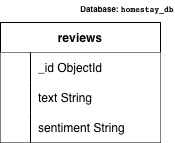

# Homestay Guest Review Sentiment Classifier

A web application that helps homestay owners analyze guest reviews and gain insights from customer feedback. The platform aims to classify review sentiment, identify common themes, and provide useful information to improve guest experience.

## Features

* Sentiment Analysis
* Theme Detection
* AI-powered Review Insights
* Responsive User Interface

## Tech Stack

* React
* Vite
* Tailwind CSS
* MongoDB
* Mongoose

## Project Structure

```text
homestay-review-classifier/
├── backend/
│   ├── models/
│   │   └── Review.js
│   ├── .env.example
│   ├── package.json
│   └── server.js
├── public/
├── src/
│   ├── assets/
│   ├── components/
│   │   ├── ui/
│   │   │   ├── Button.jsx
│   │   │   ├── index.js
│   │   │   ├── Input.jsx
│   │   │   ├── Loader.jsx
│   │   │   ├── Modal.jsx
│   │   │   └── Toast.jsx
│   │   ├── Card.jsx
│   │   ├── Footer.jsx
│   │   ├── Hero.jsx
│   │   └── Navbar.jsx
│   ├── pages/
│   │   ├── About.jsx
│   │   ├── Dashboard.jsx
│   │   ├── Home.jsx
│   │   └── Reviews.jsx
│   ├── App.css
│   ├── App.jsx
│   ├── index.css
│   └── main.jsx
├── .gitignore
├── eslint.config.js
├── index.html
├── package.json
├── tailwind.config.js
└── vite.config.js
```

## Schema diagram


## Database Choice
For this project, we chose MongoDB alongside the Mongoose ODM. As a NoSQL database, MongoDB provides a flexible, document-based structure that perfectly aligns with the JSON objects our frontend sends and receives. It allows us to easily store unstructured review text and sentiment tags without the rigid constraints of a SQL schema, which is ideal for an AI review classifier that might expand to include additional unstructured data fields later.

### Set up the database
To connect this project to your own database, follow these steps:
1. Create a free MongoDB Atlas cluster and retrieve your connection string.
2. Under "Network Access" in MongoDB Atlas, ensure your current IP address (or `0.0.0.0/0`) is whitelisted.
3. In your local project, navigate to the `backend` folder.
4. Create a `.env` file and add your secure connection string: 
   `MONGO_URI="your_connection_string_here"`

## How to run locally
1. Open a terminal and navigate to the backend folder: `cd backend`
2. Install backend dependencies: `npm install`
3. Start the server: `node server.js`
4. Open a second terminal for the frontend: `cd src` (or your root folder)
5. Install frontend dependencies: `npm install`
6. Start the React app: `npm run dev`

## Author
Bhaavya Srivastava
